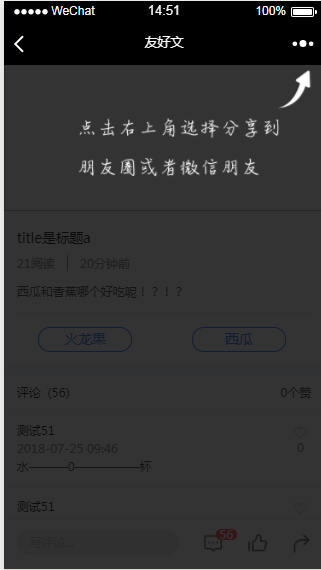

*在做xxx的时候，需要在文章详情页加入分享功能，在此时需要根据几种情况进行相应操作*
1. 当用户在**APP**中点击分享时，需要调用App的桥接，至于之后的分享操作就是App那边的事了
2. 当用户在**微信**中点击分享时，即用户在微信中打开了文章详情页，然后点击了页面的分享操作
    - 需要指示用户去微信自带的分享接口分享文章
    - 需要定义好相关分享内容
    
3. 当用户在**其他浏览器**打开了文章详情，需要提示用户此处不支持分享


*此处重点讲解在微信中进行分享的情况* [微信相关接口](https://mp.weixin.qq.com/wiki?t=resource/res_main&id=mp1421141115)
#### 调用微信JS-SDK的步骤如下：
- 引入JS文件（其他版本也可以）http://res.wx.qq.com/open/js/jweixin-1.2.0.js；
- 通过config接口注入权限验证配置，所有使用JS-SDK的页面都必须先注入配置信息，否则无法调用
- 通过ready接口处理成功验证
- 引入相关分享接口
在此我使用了“分享给朋友”接口：onMenuShareAppMessage和“分享到朋友圈”接口：onMenuShareTimeline
```
if (isWeiXin()) {
    wxshareInit({title: shareInfo.title, imgUrl: shareInfo.icon, desc: shareInfo.desc}); // 此处为分享的内容，分别对应为分享的标题、图标以及相关描述，此分享内容为自定义
}
 // 注入权限验证配置
const getSign = () => {
    const requestData = {
        url: window.location.href.split('#')[0];
    };
    request(Api.getSign, requestData, 'post').then((data: any) => { //此处Api.getSign为APP后台的接口，是要获取相对应的配置信息
        wx.config({
            debug: false,               // 开启调试模式与否
            appId: data.appId,          // 标识
            timestamp: data.timestamp,  // 生成签名的事件
            nonceStr: data.nonceStr,    // 生成签名的随机字符串
            signature: data.signature,  // 签名
            jsApiList: ['onMenuShareAppMessage', 'onMenuShareTimeline'] // 需要使用的js列表接口，这里我使用到的分别是分享给朋友和分享到朋友圈接口
        });
    }, () => {
        console.log('获取签名失败！');
    });
};
const wxshareInit = (options: any) => {
    getSign();
    wx.ready(() => {
        wx.checkJsApi({jsApiList: ['onMenuShareTimeline', 'onMenuShareAppMessage']}); //判断当前客户端是否支持指定的JS接口
        wx.onMenuShareAppMessage({       //获取“分享给朋友”按钮点击状态及自定义分享内容接口
            ...options,                 // 传入的分享内容
            success: (res: any) => {},  // 用户点击了分享后的回调函数
            cancel: (res: any) => {},   // 用户取消了分享后的回调函数
            fail:  () => {}             // 用户分享失败后的回调函数
        });
        wx.onMenuShareTimeline({        //获取“分享到朋友圈”按钮点击状态及自定义分享内容接口
            ...options,
            success:  (res: any) => {},
            cancel:  (res: any) => {},
            fail:  () => {}
        });
    });
};
```
