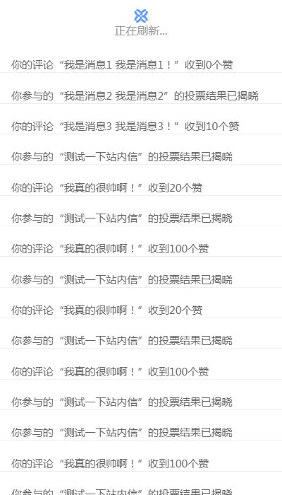
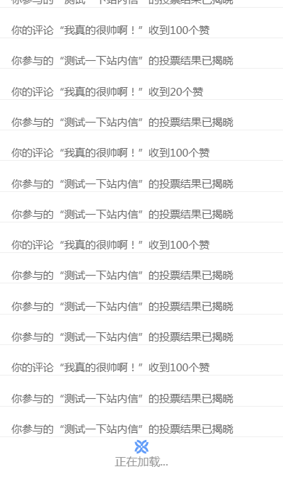

在做xxx项目的时候，在消息页和评论页都需要用到上下拉刷新,在项目中这两个页面的上下拉刷新是各写了一套，后来发现里面有许多相似的逻辑，而且将上下拉刷新直接写在页面中，会造成跟页面逻辑的大量耦合，不符合组件分离的思想。所以后来我将上下拉组件抽离出来，做成单独的组件，以便于后续的复用。

此组件实现的功能为：
1. 上拉时加载更多数据
2. 下拉时重新刷新数据

- better-scorll
  因为是移动端滚动列表，所以在此引入better-scroll插件，[better-scroll相关API](https://ustbhuangyi.github.io/better-scroll/doc/zh-hans/#better-scroll %E6%98%AF%E4%BB%80%E4%B9%88)
  better-scroll 原理为：父容器中包含滚动的子内容，当子元素的高度高于父元素时，才能进行滚动

在scroll组件中，wrapper元素表示父容器，他的高度固定，并且需要定位在页面固定元素，而子内容的高度由内容撑开，当内容高度小于父容器时，列表自然不能滚动，只有当它的高度大于父元素时，才能实现滚动效果。以消息中心也为例，滚动的消息列表为content内容，消息列表组件命名为message，上下拉刷新scroll组件中的wrapper元素需要包含message的列表内容，因为是在消息列表页引入scroll子组件，所以若要在scroll组件中引入父组件列表的滚动内容，需要用到vue中的slot插槽。

```上下拉刷新scroll组件的结构
<div class="scroll">  
        <div ref="wrapper" class="scrollWrapper">
            <slot></slot> // 此处为引入的列表内容
            </div>
        </div>
    </div>
```
先来看上下拉刷新组件中的内容，此组件的理想展示效果如下图，当用户下拉超过一定的距离时，刷新页面，列表回到初始状态，并同时出现刷新提示和图标，过了设定时间后消失；当用户在底部上拉距离超过一定距离时，加载数据，拼接到父组件列表下部，同时出现加载提示和图标，过了设定时间后消失。上拉和下拉的页面展示如下图所示：
<table style="border-collapse: collapse;">
    <tr>
        <td> </td>
        <td></td>
    </tr>
</table>
scroll子组件的结构中需要增加上下拉所需展示的dom元素：
``` scroll.vue 结构
<div class="scroll">
            <div class="pull-tips pullDown_tip" :class="pulldown ? 'pulldown-ani' : ''">
                    <div class="pull_img">
                        
                    </div>
                    <p class="tip_content" v-html="pullDownTip.text"></p>
            </div>
            <div ref="wrapper" class="scrollWrapper">
                <slot></slot>
                <div v-show="pullup" class="pull-tips pullUp_tip">
                        <div class="pull_img">
                            
                        </div>
                        <p class="tip_content" v-html="pullupTip.text"></p>
                </div>
            </div>
```

我们如何初始化better-scroll呢？初始化代码如下：
```
import BScroll from 'better-scroll';
const wrapper:any = this.$refs.wrapper;
this.scroll = new BScroll(wrapper,{
    click: true,
         scrollY: true,
         pullUpLoad: {
             threshold: -5 // 当上拉距离超过10px时触发 pullingUp 事件
         },
         pullDownRefresh: {
             threshold: 60, // 当下拉距离超过60px时触发 pullingDown 事件
             stop: 60
         }
})
```
better-scroll会暴露出一个BScroll的类，我们初始化只需new这个类的实例即可，第一项为父容器wrapper的Dom对象，对二项为配置的一些参数。better-scroll的初始化时机很重要，只有保证父元素和子元素正确的渲染了，才能正常滚动，所以在vue中，在初始化Bscroll时，必须确保元素已经渲染到页面，当DOM解构发生变化时，必须调用refresh()方法，重新计算better-scroll，才能确保滚动的正常效果。
在vue中，mounted生命周期表示vue模板对应html渲染完成，this.$nextTick是在下次DOM更新循环结束后调用回调函数，所以可以在回调函数中获取更新后的DOM，所以我们在vue的mounted生命周期中调用nextTick方法，并在它的的回调函数中初始化better-scroll
接下来我们来看下JS部分的一些关键代码：
```
    @Prop({})
    messageData:Array<string>    //父组件传过来的列表数据
    mounted(){
        this.$nextTick(() => {
            this.$emit('pulldown','init');
            this.initScroll();
        })
   }
      public initScroll(){
       this.$nextTick(()=>{
           if(!this.scroll){
           const wrapper:any = this.$refs.wrapper;
           this.scroll = new BScroll(wrapper,{
               click: true,
                    scrollY: true,
                    pullUpLoad: {
                        threshold: -5 // 当上拉距离超过10px时触发 pullingUp 事件
                    },
                    pullDownRefresh: {
                        threshold: 60, // 当下拉距离超过60px时触发 pullingDown 事件
                        stop: 60
                    }
           })
            const self = this;
            // 用于下拉刷新
            this.scroll.on('pullingDown', (pos: any) => {
                self.pulldown = true;
                 this.pullDownTip = {
                    text: '正在刷新...',
                    icon: true
                }
                this.scroll.disable();
                setTimeout(() => {
                    this.pulldown = false;
                    self.$emit('pull','refresh');
                    self.scroll.enable();
                    self.scroll.finishPullDown();
                }, 800);
            })
            // 上拉加载
            this.scroll.on('pullingUp', (pos: any) => {
            self.pullup = true;
            self.pullupTip = {
                    icon: true,
                    text: '正在加载...'
            };
            this.scroll.disable();
            setTimeout(() => {
                    this.pullup = false;
                    self.$emit('pull','add');
                    self.scroll.finishPullUp();
                    self.scroll.enable();
                }, 800);
            })
        }else{
            this.scroll.refresh();
        }
       })
       
   }
    // 监听数据的变化，保证滚动效果的正常
    @watch
    messageData
    public onDataChanged() {
     setTimeout(() => {
      this.refresh()
    }, 20)}
```
scroll组件的大致原理如上所述，那么调用这个子组件的父组件需要做什么呢
- 子组件中上拉下拉开启与否可由父组件控制
- 是滚动列表的内容是在父组件中呈现的
- 当上下拉组件在发生上拉或下拉事件时，列表中的内容相应变化
- 可以引入其他loading、提示相关子组件，当数据请求错误或是数据在加载时，相应设置子组件的状态

父组件html结构如下：
```
 <div>
        <loading ref = "loading"/>
        <Scroll  @pull="initMessageData" :messageData="messageData">
            <div class="message">
                <div class="list_wrapper"  v-if="messageData.length > 0">
                    <div class="message_list" >
                        <ul class="message_scroll">
                            <li class="message_detail" v-for="(item, index) in messageData" :key="index">
                                <div class="detail">
                                    <p class="message_content" v-html="item.content"></p>
                                </div>
                            </li>
                        </ul>
                    </div>
                </div> 
            </div>        
        </Scroll>
    </div>
```
messageData为message组件请求的列表数据，当子组件发生上拉或下拉操作时，会传递一个pull事件到父元素中，在下拉时，传递'refresh'参数，下拉时，传递'add'参数，父组件中的initMessageData事件会被触发.

```
     /**
     * @description 获取消息数据
     * @param {string} type add:增加;init:初始化;refresh:刷新
     * @author oyff
     */
    public initMessageData(type: string) {
        if ( type === 'refresh'|| type === 'init') { //当用户下拉刷新或是初次加载页面时，都将数据重新置空，请求后台第一页数据进行渲染，pageNo为请求数据的页码
            this.messageData = [];
            this.noMessage = false;
            this.pageNo = 1;
        }
        let requestData = {
            pageNo: this.pageNo,
            pageSize: this.pageSize
        };
        
        this.loading.setLoading({
            showLoading:　true
        });
        // 当用户上拉加载时，不需要重新制定初始数据，直接请求新数据，此时的页码相对于前一个请求+1
        request('http://172.30.3.67:7300/mock/5b3197a4538393549ec185fa/example/testMessage', requestData, 'post').then((data: any) => {
            this.loading.setLoading({
            showLoading:　false
            });
            if (data.code === 100005) {
                // 当用户未登录时，这里可作一些提示操作
            }else if (data.code === 0) {
                const messageList = data.content.dataList;
                if (messageList.length > 0) {
                    this.messageData = this.messageData.concat(messageList);
                    this.pageNo++; 
                }
            } else {
                this.toast.setToast({
                showToast: true,
                toastText: '网络异常，请稍后再试'
            });
            }
        }, () => {
            this.toast.setToast({
                showToast: true,
                toastText: '网络异常，请稍后再试'
            })
        });
    }
```

github中的示例代码地址：https://github.com/fredaouyang/scroll
