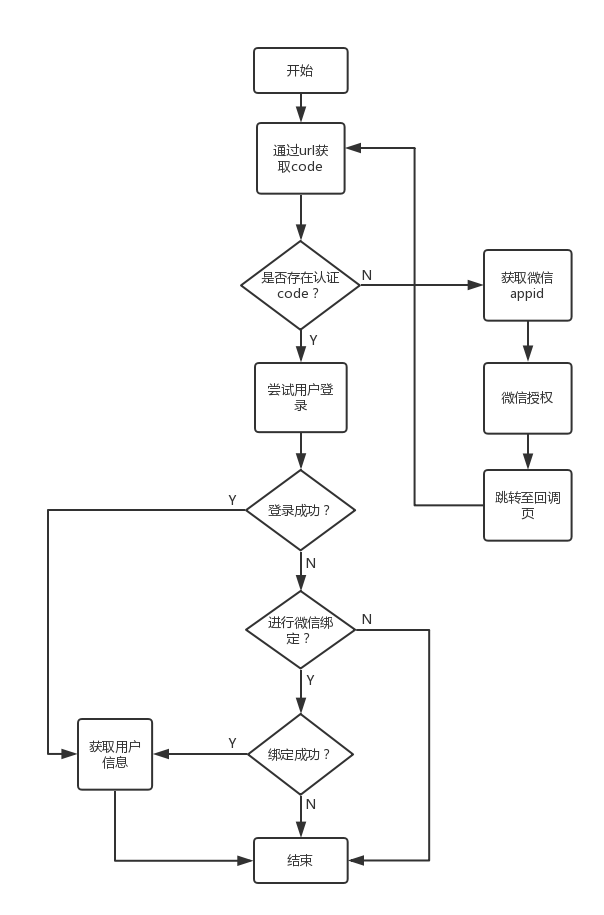
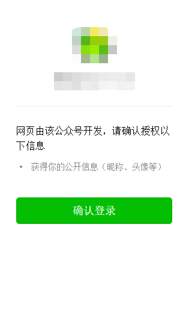
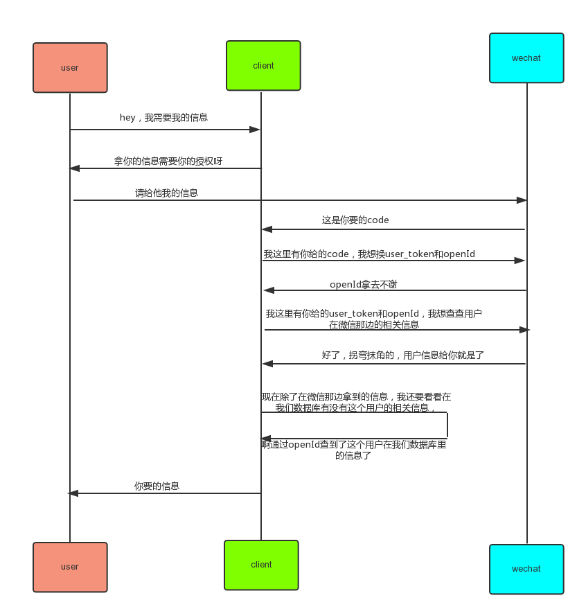

前段时间做了一个引导用户将微信号与公司账号绑定的需求，虽然乍听上去挺简单，但其中涉及到的细节却比较多，而且也踩到了几个坑，所以还是有记录的价值。
整个业务流程可以用下面这张流程图来表示。

涉及到的相关知识点有:
- 微信授权第三方登录
- 获取微信用户信息的流程
- 引导用户关注公众号


#### openid和unionid
`openid`：为了识别用户，每个用户针对每个公众号或小程序等应用会产生一个安全的openid，公众号或应用可将此ID进行存储，便于用户下次登录时辨识其身份，或将其与用户在第三方应用中的原有账号进行绑定
`unionid`:unionid也是用户的标识符，但它与openid不同的是，同一个微信用户，登录同一个开发主体下的多个小程序或公众号的时候，分配的unionid是一样的。

可以打个通俗的比喻，比如某个用户是万达商场的会员，那么unionId就是这个用户对应的万达会员标识，而这个用户又比较爱买买买，在万达商场的很多商店下面都是会员，那么此时每个商店赋予这个用户的会员号就相当于openid了，总而言之，在同一个开发体下，unionid是唯一的，而openid不一定唯一。


#### 微信授权登录
如果用户在微信客户端中访问第三方网页，那么第三方网页需要通过微信网页的授权机制，来获取用户的基本信息，进而实现业务逻辑。用户授权登录的方式分为两种，一种是显式授权登录,一种是静默的授权登录。
`显式的授权登录页`：这种方式是以snsapi_userinfo为scope发起的网页授权，是用来获取用户的基本信息的。需要用户手动点击登录按钮同意授权，可以获取较多的信息，比如用户头像、昵称、openId、unionId、是否关注公众号等。


`静默授权登录页`：用户在无感知的情况下进行了授权。这种授权是以snsapi_base为scope发起的网页授权，是用来获取用户的openId，用户无需进入授权页就进入了第三方业务页。

#### 授权流程
整个授权流程在微信开发者文档已有了比较清晰的解释，具体可点击[微信网页授权](https://mp.weixin.qq.com/wiki?t=resource/res_main&id=mp1421140842)。

| 参数        | 是否必须  |  说明  |
| :--------:  | :-----:| :----: |
| appid        | 是 |  公众号的标识 |
| redirect_uri  | 是 |   用户授权后需进入的第三方页面地址   |
| response_type        | 是      |   返回类型，请写code   |
| scope       | 是      |  应用授权作用域，snsapi_base （不弹出授权页面，直接跳转，只能获取用户openid），snsapi_userinfo （弹出授权页面，可通过openid拿到昵称、性别、所在地。并且， 即使在未关注的情况下，只要用户授权，也能获取其信息 ） |
| state  | 否     |   重定向后会带上state参数，开发者可以填写a-zA-Z0-9的参数值，最多128字节   |
| wechat_redirect       | 是      |   无论直接打开还是做页面302重定向时候，必须带此参数   |
整个过程可以总结成以下步骤:
1. 引导进入授权页
用户授权需要进入以下页面（页面链接参数解释如上表所示）：
`https://open.weixin.qq.com/connect/oauth2/authorize?appid=APPID&redirect_uri=REDIRECT_URI&response_type=code&scope=SCOPE&  state=STATE#wechat_redirect`
2. 用户同意授权(scope=snsapi_base无此步骤)
3. 授权后成功后服务器将code回传回来并重定向到第一步配置的回调页面
4. 微信公众号通过code向微信服务器请求openId
5. 微信公众账号通过Access Token向服务器请求用户信息(scope为snsapi_base时无此步骤)
6. 服务器将用户信息回送给微信公众账号(scope为snsapi_base时无此步骤)
7. 微信公众号通过openId向本服务器请求用户信息（若此openId已与第三方账号有所关联，那么可依据openId查询到用户在第三方数据库中的信息）
整个流程图如下所示：


`相关代码`
用户进入页面时首先判断是否存在微信返回的授权code，如果没有，则代表用户未进行授权，需要进入授权页
```
   function getUserInfo(callback){
        // 如果认证的code存在
        if (params.code) {
            const code = encodeURIComponent(params.code);
            const data = {
                mchId: 'WX001',
                code,
            };
            const _params = new Params(params);
            delete _params.code;
            history.replaceState(null, null, _params);
            $loader.show();
            request('/node_api/user.do?fn=wxUserInfo', 'GET', data).then((res) => {
                $loader.hide();
                if (res.code === 0){
                    const userInfo = {};
                    try {
                        userInfo.wxInfo = res.content.userinfo || {};
                        userInfo.isbind = res.content.isBind;
                        userInfo.channelUserId = res.content.channelUserId;
                    } catch (ex) {
                        userInfo.wxInfo = {};
                        userInfo.isbind = false;
                    }
                    if (!userInfo.isbind) {
                        const userToken = {
                            accessToken: res.content.accessToken || '',
                            channelId: res.content.channelId || '',
                            channelUserId: res.content.channelUserId || '',
                            unionId: res.content.unionId || ''
                        };
                    // 将userToken写入cookie
                    document.cookie = 'userToken=' + encodeURIComponent(JSON.stringify(userToken));
                }
                callback(userInfo);
            }else{
                // 请求sso/login接口失败，弹提示信息
                showTextMessage(res.msg);
            }}, () => {
                $loader.hide();
                showTextMessage('网络异常，请稍后再试');
                deleteCode();
            });
        }else{
            // 无code 则进行微信认证
            authorize();
        }
    }
```

授权过程：

```
  function authorize(){
        let e = location.href;
        if (!/xxx.com/.test(location.host) && !(location.port === '' || location.port === '80')) {
            const reg = new RegExp(':' + location.port);
            e = e.replace(reg, function(i) {
                return '/' + i.substr(1);
            }).replace('http:', 'https:');
        }
        e = encodeURIComponent(e);
        getWXAppId(function(res) {
            const appid = res.appId;
            window.location.href = 'https://open.weixin.qq.com/connect/oauth2/authorize?appid=' + appid + '&redirect_uri=' + e + '&response_type=code&scope=' + (params.isbase ? 'snsapi_base' : 'snsapi_userinfo') + '&state=STATE#wechat_redirect';
        });
    }
```